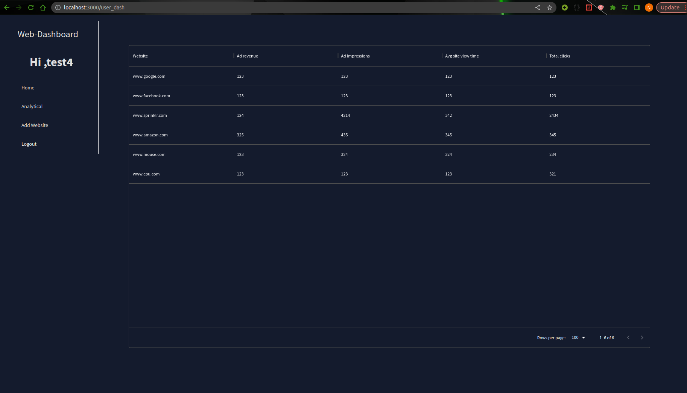
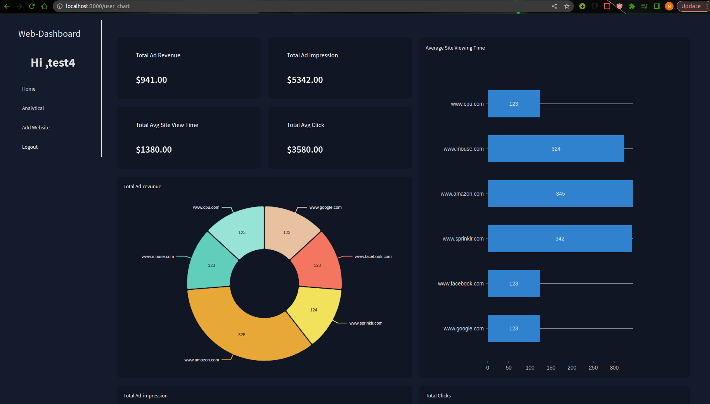
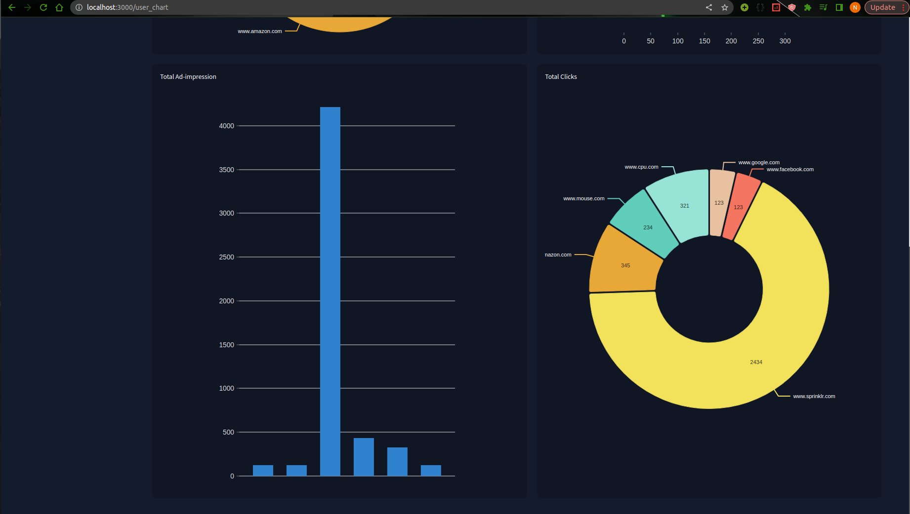
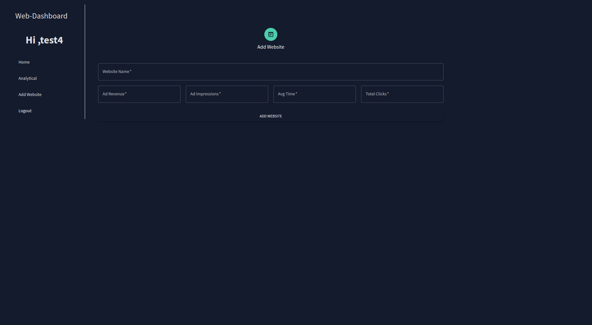
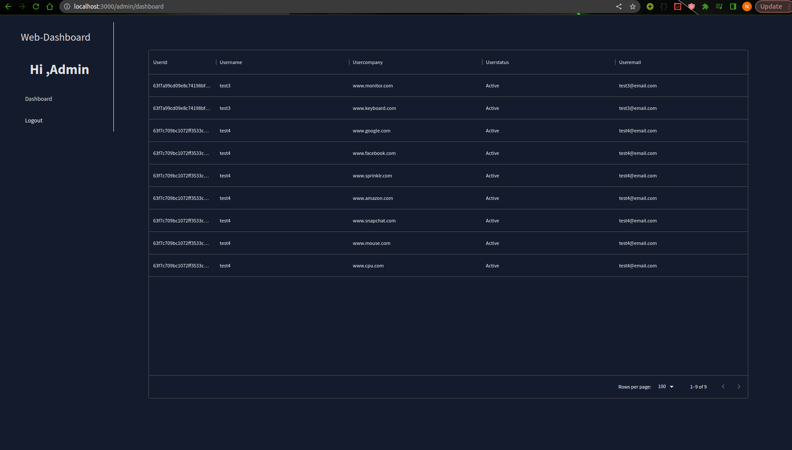

## Preview url : https://dashboard-nextjs-eta.vercel.app/

## Techstack Used : NextJS , Material UI.

## Preview

### Admin Login

- email : admin@email.com
- pass: admin

### User Login

- email: test4@email.com
- pass: test4

### User Routes

- "/" : Index Page
- "/login" : User login
- "/forgot" : User Forgot
- "/signup" : User Signup
- "/user_chart" : User Analytics
- "/user_dash" : User Dashboard
- "/user_web" : Add websites by user

### Admin Routes

- "/admin/login" : Admin login
- "/admin/dashboard" : Admin Dashboard

### User Home



### User Analytics-I



### User Analytics-II



### User Website Add



### Admin Dashboard



## Installations

Install the dependencies and devDependencies and start the server.

```sh
cd dashboard
npm i
npm start

```

First, run the development server:

```bash
npm run dev
# or
yarn dev
# or
pnpm dev
```
